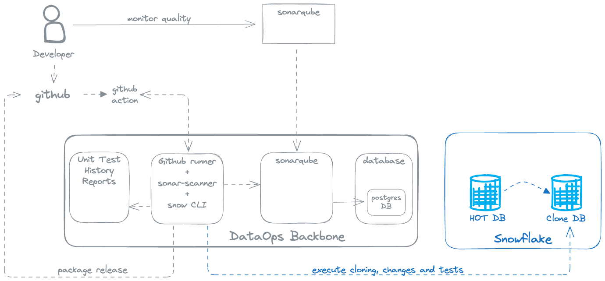

# Mother-of-all-Projects

# Mother of All Projects

**A showcase of a fully automated DevOps pipeline for code quality validation using SonarQube and custom rule enhancements.**

---

## Overview

This repository demonstrates a comprehensive DevOps setup that automates code quality reviews using **SonarQube**, with a special focus on:

- Pull latest changes GitHub
- Code quality check
- **SQL [sonar-sql-plugin](https://github.com/gretard/sonar-sql-plugin)** and **Regex-based custom rules** via the [SonarQube Text Plugin](https://github.com/SonarQubeCommunity/sonar-text-plugin)
- Clone reference Database (zero copy clone)
- Test release
- Package release

... all Seamless integration with **GitHub Actions**

It is intended as a **reference architecture** for teams looking to implement advanced static analysis in a DevOps workflow for **Snowflake**.

---

## Architecture

This project is split into **two repositories**:

1. **This repository**:  
   _Source code and pipeline configuration for demonstrating SonarQube quality gates, including SQL-heavy and text-based logic._

2. **There is a second project [DataOps - Backbone](https://github.com/zBrainiac/DataOpsBackbone)**:  
   _A Docker-based infrastructure stack that includes SonarQube, PostgreSQL, Unit Test History and GitHub self-hosted runners._
    - Easily deployable using `docker-compose`
    - Preconfigured with necessary plugins and custom rules
    - Supports local testing and CI simulation
3. **Overview of the infrastructure**:

---

## Features

- ✅ GitHub Actions integration with custom self-hosted runners
- ✅ Automated SonarQube analysis on every push and pull request
- ✅ SQL + Regex rule support via SonarQube Text Plugin
- ✅ Custom quality gate enforcement
- ✅ Local infrastructure for offline testing

---